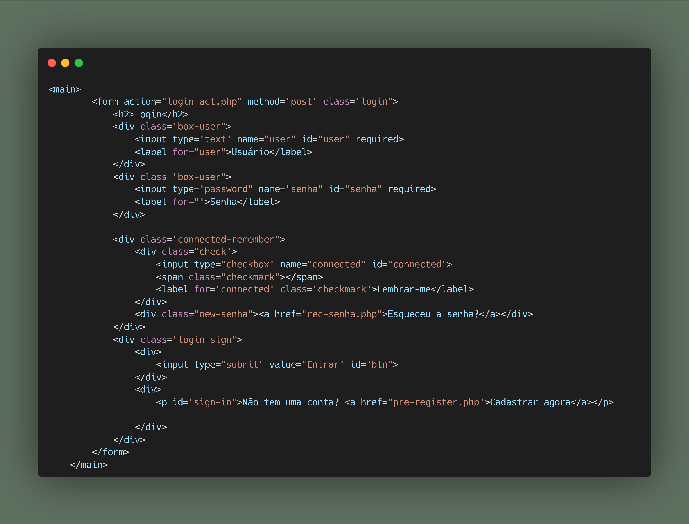

**APPWARE** é um projeto de site desenvolvido como Trabalho de Conclusão de Curso em Análise e Desenvolvimento de Sistemas na Etec Centro Paula Souza. O projeto utiliza PHP, HTML, CSS, MySQL, JavaScript, Python e SCSS.

## Visão Geral

Esse projeto foi criado como atividade para conclusão do curso Técnico em Análise e Desenvolvimento de Sistemas da Etec Centro Paula Souza. Ele consiste em um site que funciona como um catálogo de jogos eletrônicos para computadores, onde testa a compatibilidade das configurações do computador com os requisitos dos jogos, informando se é seguro ou não executar o jogo sem causar danos à máquina.

O repositório e o projeto não serão continuados, servindo apenas como registro da experiência e dos desafios enfrentados ao longo do desenvolvimento.

## Contribuintes / Equipe

- **Geovani Nascimento** - Front End
- **Gustavo Ferreira de Souza** - Front End, Banco de Dados
- **Vitor Rodrigues de Souza** - Back End

## Funcionalidades

- Catálogo de jogos com avaliações, lista de requisitos e outras informações
- Cadastro e registro de contas no banco de dados
- Recuperação de senha usando PHPmailer
- Análise e registro das especificações do computador com um executável desenvolvido em Python
- Banco de dados em MySQL com mais de 20 jogos cadastrados
- Formulário de contato com a empresa fictícia "LDR Technology"

## Desenvolvimento

O projeto foi desenvolvido ao longo de um ano, sendo seis meses dedicados à idealização e planejamento, e seis meses à produção e codificação. Cada membro da equipe ficou responsável por áreas de acordo com suas preferências, trabalhando em conjunto sob a orientação dos professores e realizando pesquisas adicionais.

Durante o desenvolvimento, optamos por usar PHP, pois já tínhamos familiaridade com a linguagem. Utilizamos SCSS para estilizar o site, GitHub para controle de versão, e Python para criar um executável que coletava as especificações da máquina e enviava para o banco de dados vinculado à conta do usuário.

Embora o projeto tenha enfrentado muitos desafios — incluindo problemas com a detecção de especificações e perda de uma versão atualizada (o que motivou a adoção do GitHub) — conseguimos criar uma versão funcional e sem erros significativos. O maior desafio foi trabalhar com uma equipe reduzida de três pessoas, mas o esforço permitiu transmitir a visão do projeto em código.

## Status do Projeto

A versão final não possui a funcionalidade principal de análise de compatibilidade entre a máquina do usuário e os jogos, mas cumpre com outros requisitos importantes e serve como um marco para nosso aprendizado e desenvolvimento.

---

**Nota:** Este README foi criado para documentar e registrar o desenvolvimento e desafios do projeto APPWARE.
